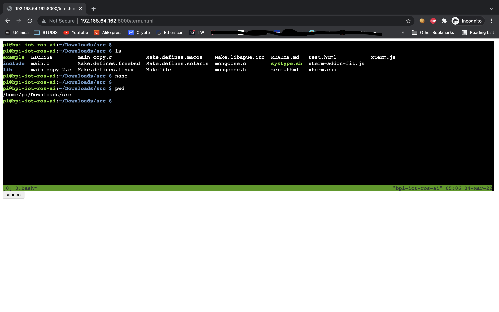

# terminal_in_browser
Terminal in browser (proof of concept)



Backend is written in C.
- Uses Mongoose (an open source embedded HTTP/Websocket/MQTT library) https://mongoose.ws/
- Parts of the code (pty) are from "Advanced Programming in the Unix Environment" http://www.apuebook.com/code3e.html

Frontend 
- xtermjs https://xtermjs.org/


Websocket (ws = not safe) is used for communication between client-server.  
Tested on: Linux(Raspbian), Mac OS.

## Requirements:
- tmux


## Installation 
```
make
```

## Run
server:
```
./example
```
client:
http://X.X.X.X:8000/term.html

